<div align="center">


# ☕ SATAR — JIMNY COFFEE

### Smart Point of Sale &amp; Coffee Shop Management

Sistem informasi kasir dan pengelolaan operasional kedai kopi berbasis web, dengan antarmuka khusus **Owner**, **Admin**, dan **Kasir**.


[**Fitur**](#-fitur-aplikasi) · [**Preview**](#-preview-antarmuka) · [**Instalasi**](#-menjalankan-project) · [**Tim**](#-tim-pengembang)

</div>

---

## ✨ Sekilas Project

**SATAR — JIMNY COFFEE** adalah project aplikasi Point of Sale (POS) berbasis Laravel untuk membantu pengelolaan pesanan, transaksi, menu, stok, laporan penjualan, dan aktivitas karyawan dalam satu sistem. Tampilan aplikasi menggunakan nuansa warna kopi dan menyediakan halaman sesuai peran pengguna.

> **Status repository:** dokumentasi antarmuka dan source code sedang digabungkan secara bertahap melalui kolaborasi GitHub. Beberapa halaman pada preview mungkin belum tersedia di branch `main` sampai semua kontribusi digabungkan.

## 🚀 Fitur Aplikasi

| Peran | Area yang ditampilkan dalam project |
| :-- | :-- |
| **Kasir** | Pemilihan menu & pesanan, pencatatan transaksi, pilihan pembayaran Cash/QRIS, presensi & izin, riwayat transaksi, laporan penjualan. |
| **Admin** | Dashboard, pengelolaan menu, log stok, pengaturan shift, pengajuan izin, pengelolaan akun, dan riwayat transaksi. |
| **Owner** | Dashboard ringkasan bisnis, laporan penjualan, riwayat transaksi, dan rekap kehadiran. |
| **Smart Insight** | Panel informasi kontekstual yang muncul pada antarmuka sebagai pendamping aktivitas pengguna. |

## 🖼️ Preview Antarmuka

### Halaman Login

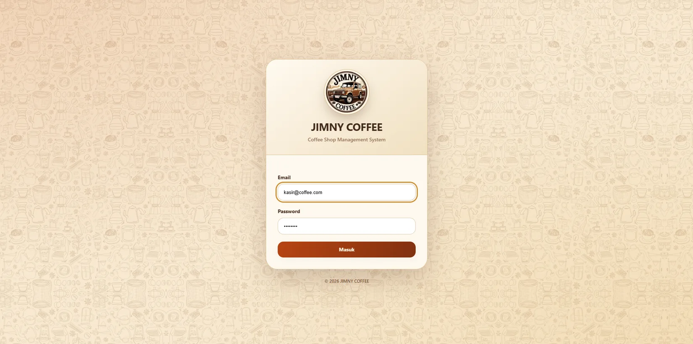

### Kasir / Point of Sale

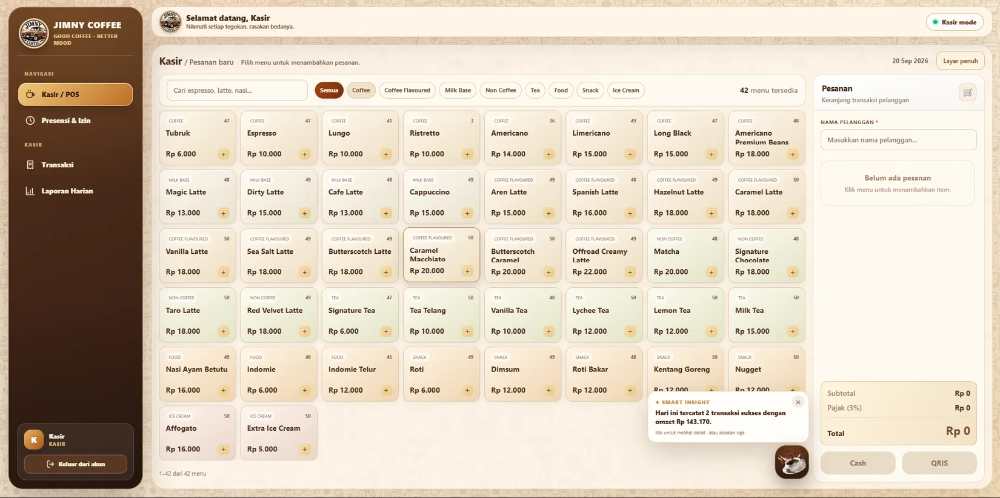

### Dashboard Owner

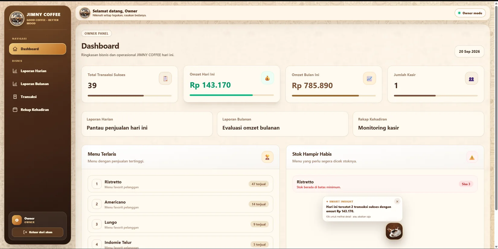

### Dashboard Admin

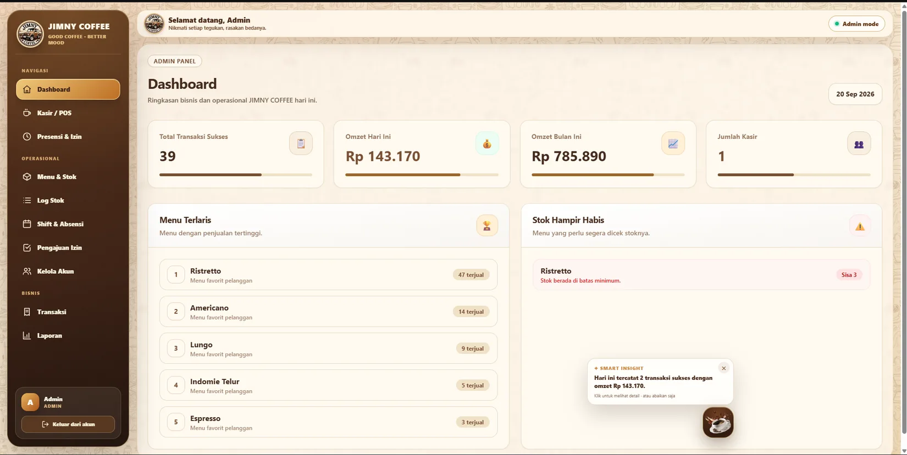

### Menu, Stok & Shift

| Kelola menu | Log stok |
| :--: | :--: |
| 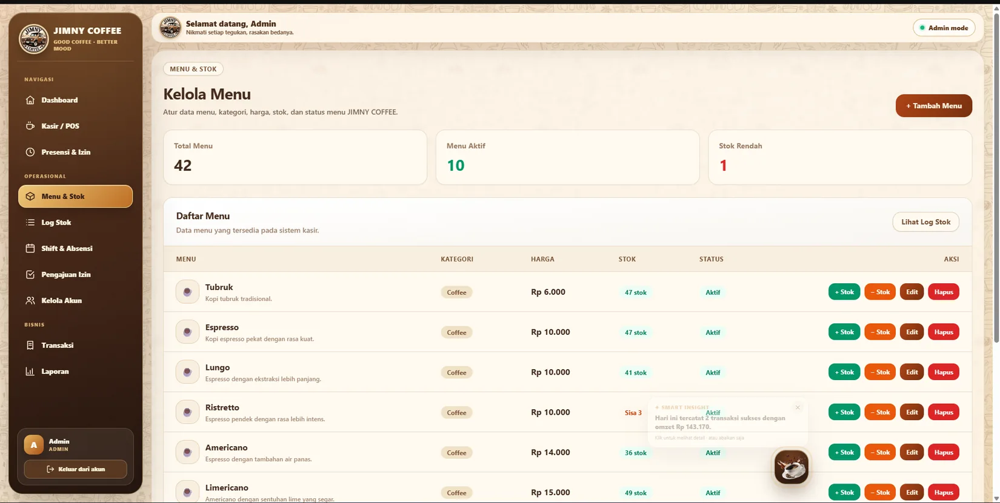 | 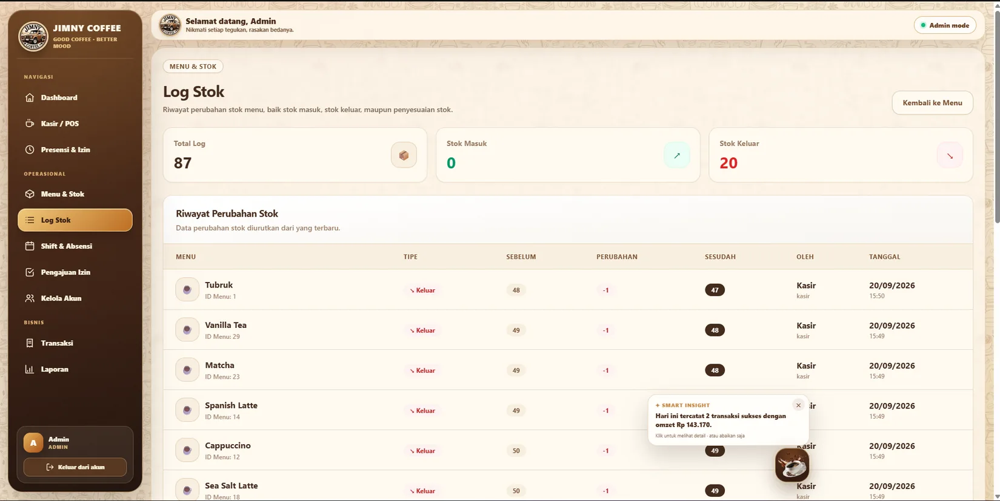 |

| Kelola shift | Kelola akun |
| :--: | :--: |
| 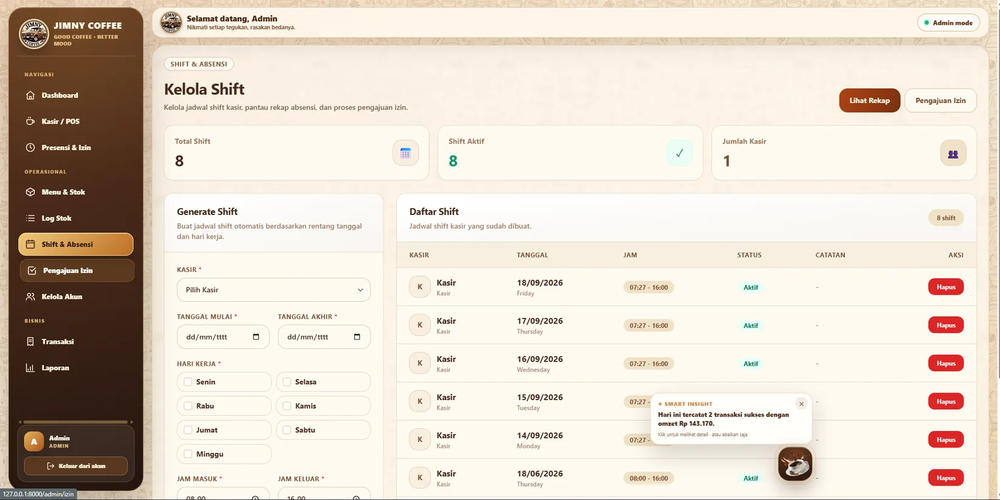 | 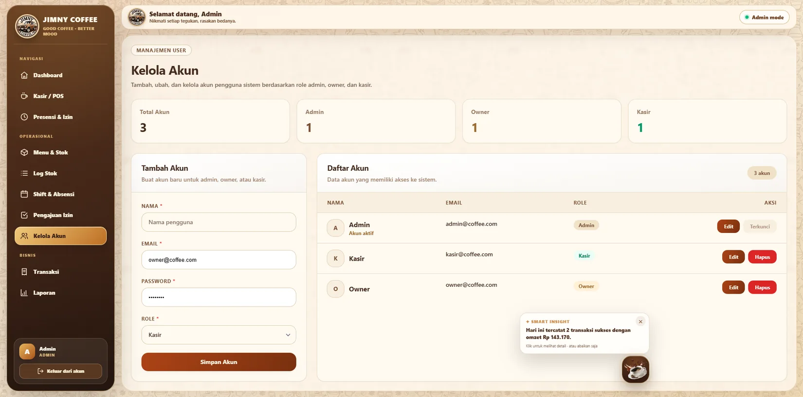 |

### Laporan & Aktivitas

| Laporan penjualan | Riwayat transaksi |
| :--: | :--: |
| 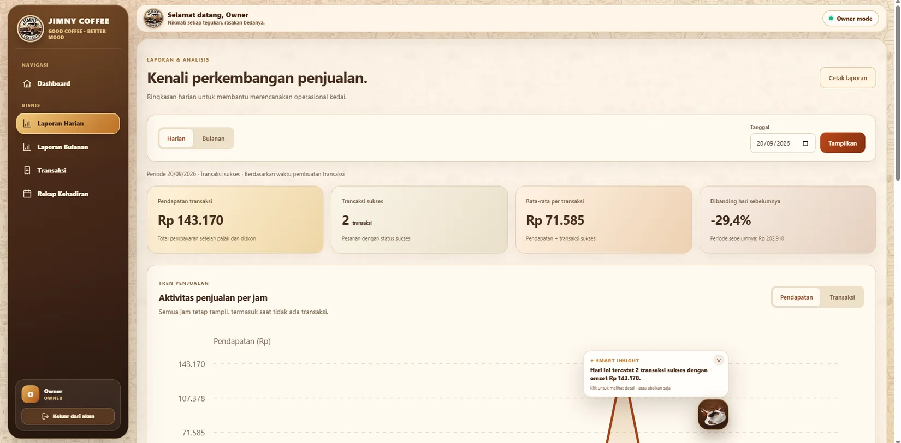 | 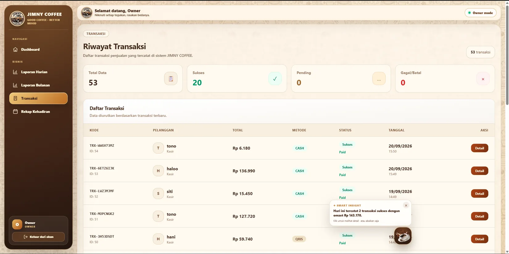 |

<details>
<summary><strong>📷 Lihat galeri tampilan lainnya (9 screenshot)</strong></summary>

<br />

| Tampilan | Preview |
| :-- | :-- |
| Presensi & izin Kasir | 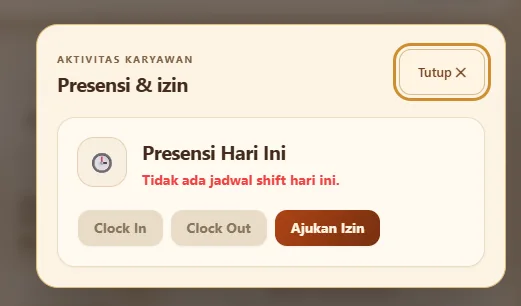 |
| Riwayat transaksi Kasir | 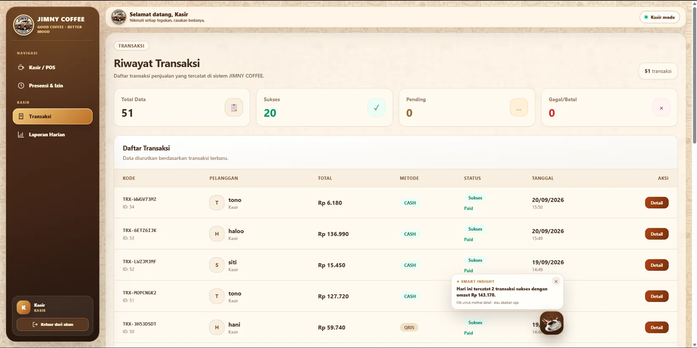 |
| Laporan penjualan Kasir | 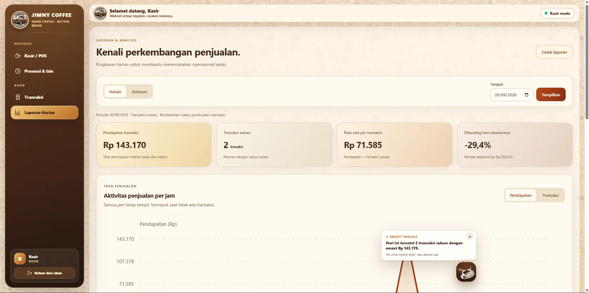 |
| Analitik penjualan Owner | 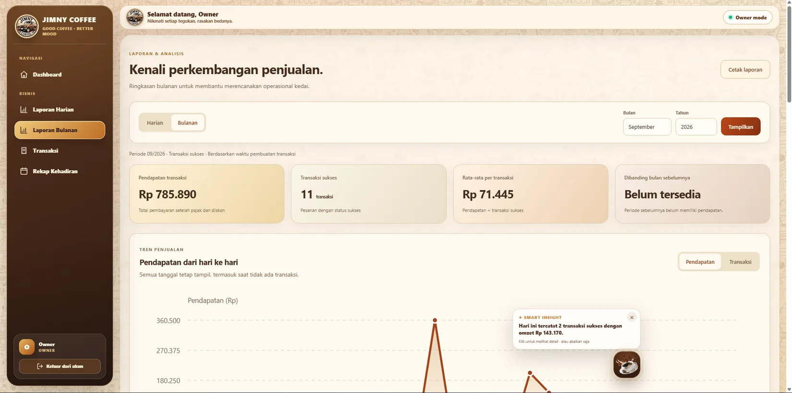 |
| Rekap kehadiran Owner | 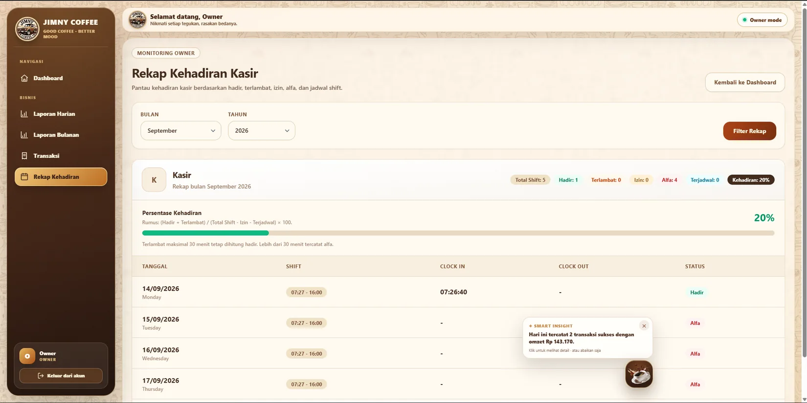 |
| POS Admin | 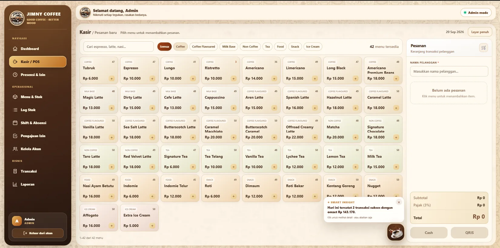 |
| Pengajuan izin Admin | 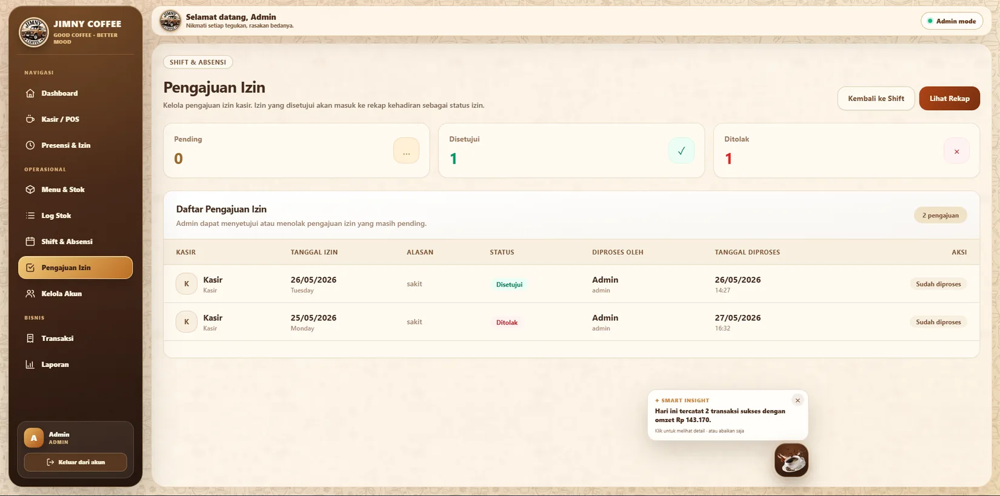 |
| Riwayat transaksi Admin | 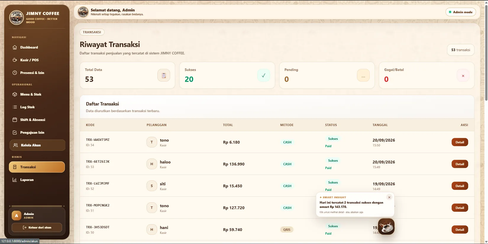 |
| Analitik penjualan Admin | 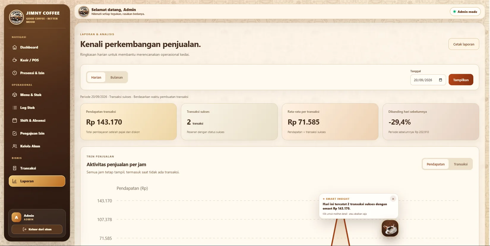 |

</details>

> Screenshot menunjukkan antarmuka pada saat pengambilan gambar. Angka penjualan, stok, dan transaksi yang terlihat merupakan contoh tampilan, bukan data operasional terkini.

## 🛠️ Teknologi

- **Backend:** PHP & Laravel
- **Database:** MySQL
- **Frontend:** Blade, Tailwind CSS, CSS, dan JavaScript
- **Build tools:** Composer, NPM, dan Vite
- **Kolaborasi:** Git & GitHub (branch dan pull request)

## ⚙️ Menjalankan Project

> Setelah seluruh bagian aplikasi digabungkan ke branch `main`, gunakan langkah berikut untuk menyiapkan project di komputer lokal. Pastikan PHP, Composer, Node.js/NPM, dan MySQL telah terpasang.

```bash
git clone https://github.com/Satar2007/Proyek-Informatika.git
cd Proyek-Informatika
composer install
npm install
```

Buat file konfigurasi lokal dari `.env.example` (PowerShell/Windows):

```powershell
Copy-Item .env.example .env
php artisan key:generate
```

Atur `DB_DATABASE`, `DB_USERNAME`, dan `DB_PASSWORD` di `.env` sesuai database MySQL lokal. Setelah database dibuat, jalankan:

```bash
php artisan migrate --seed
php artisan serve
```

Untuk membangun aset frontend, jalankan pada **terminal lain**:

```bash
npm run dev
```

Buka alamat lokal yang ditampilkan oleh `php artisan serve` (umumnya `http://127.0.0.1:8000`).

**Penting:** Seeder project menyertakan akun contoh untuk pengujian lokal. Jangan gunakan password contoh di deployment nyata. File `.env`, database lokal, `vendor/`, dan `node_modules/` tidak perlu diunggah ke repository. Aset QRIS asli juga tidak disertakan dalam repository publik.

## Konfigurasi Midtrans Sandbox

Project SATAR menggunakan **Midtrans Sandbox** untuk simulasi pembayaran QRIS selama development.

Setelah membuat file `.env`, isi konfigurasi berikut menggunakan credential Sandbox dari akun Midtrans masing-masing:

```env
MIDTRANS_IS_PRODUCTION=false
MIDTRANS_SERVER_KEY=isi_server_key_sandbox
MIDTRANS_CLIENT_KEY=isi_client_key_sandbox
```

> Jangan menaruh Server Key atau Client Key asli di `.env.example`, README, commit Git, atau repository publik. File `.env` sudah dikecualikan melalui `.gitignore`.

Konfigurasi tersebut dibaca oleh `config/midtrans.php`. Ketika `MIDTRANS_IS_PRODUCTION=false`, aplikasi menggunakan environment Sandbox Midtrans.

### HTTP Notification / Webhook

Endpoint notification yang tersedia pada aplikasi:

```text
POST /midtrans/notification
```

Route ini tidak menggunakan autentikasi login karena request dikirim langsung oleh server Midtrans. Validitas notification diverifikasi oleh aplikasi menggunakan signature Midtrans.

Untuk pengujian notification dari Midtrans, aplikasi lokal harus dapat diakses melalui URL publik. `localhost` atau `127.0.0.1` tidak dapat dipanggil langsung oleh server Midtrans, sehingga gunakan tunnel HTTPS saat menguji webhook.

Contoh URL notification setelah aplikasi tersedia secara publik:

```text
https://domain-atau-tunnel.example/midtrans/notification
```

Masukkan URL tersebut sebagai Payment Notification URL pada konfigurasi Midtrans Sandbox.

### Simulasi pembayaran QRIS

Pembayaran QRIS Sandbox dapat diuji melalui simulator Midtrans:

```text
https://simulator.sandbox.midtrans.com/qris/index
```

Gunakan transaksi Sandbox yang dihasilkan aplikasi. Setelah simulasi pembayaran, perubahan status dapat diterima melalui notification/webhook atau melalui pengecekan status pembayaran yang tersedia pada aplikasi.

Konfigurasi ini ditujukan untuk development. Jangan menggunakan `MIDTRANS_IS_PRODUCTION=true` sebelum aplikasi benar-benar menggunakan credential dan konfigurasi Midtrans Production.

## 👥 Tim Pengembang

| Nama | NIM |
| :-- | :-- |
| Valentinus Panjaitan | 245314074 |
| Dion Agung Kadang | 245314083 |
| Andika Novanda Putra | 245314084 |
| Rafael Paskah Bintang Pinasthi | 245314089 |
| Afrino Alka Daraya | 245314090 |

---

<div align="center">

**SATAR — JIMNY COFFEE** · Project kolaborasi Informatika

</div>
